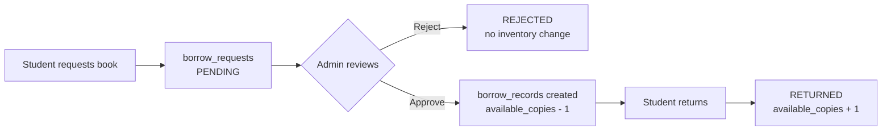

# BookWise

**A university library system where borrowing a book is a request, not a checkout.**

Students sign up with their university ID card, an admin verifies them, and only verified students can request books. Every borrow goes through admin approval before a copy actually leaves the shelf.

<p>


</p>

**Live app:** https://university-library-management-syste-nine.vercel.app

<!-- Drop a screenshot or short GIF of the admin approval screen here. It sells the project faster than any paragraph.

-->

---

## Contents

1. [What it does](#what-it-does)
2. [Data model](#data-model)
3. [Auth and access control](#auth-and-access-control)
4. [What runs where, and why](#what-runs-where-and-why)
5. [Rate limiting](#rate-limiting)
6. [Setup](#setup)
7. [Known limitations](#known-limitations)
8. [What I would do next](#what-i-would-do-next)

---

## What it does

**For students**

- Sign up with name, email, university ID number, and a photo of your university card. New accounts start as `PENDING` and stay that way until an admin approves them.
- Browse books by genre, search by title or author, open a book page with cover, summary, and a preview video.
- Request to borrow a book. You get a pending request, not an instant checkout.
- See your own requests and current loans on your profile, and return a book when you are done.

**For admins**

- A separate admin area for the whole approval surface: pending user registrations, pending borrow requests, borrow logs, and book CRUD.
- Approving a borrow request is the moment inventory actually moves. It creates the borrow record, decrements available copies, and marks the request approved. Rejecting it does none of that.
- Add and edit books with cover upload, preview video upload, and a colour picker that sets the spine colour used across the UI.

### The borrow flow



Inventory only moves at the approval step. A pending request holds no copy, and a rejected one leaves no trace in the loan history.

---

## Data model

Four tables, three enums, in `database/schema.ts`.

| Table | What it holds |
|---|---|
| `users` | Account details, hashed password, `university_id`, uploaded card image URL, `status` (PENDING / APPROVED / REJECTED), `role` (USER / ADMIN), last activity date |
| `books` | Title, author, genre, rating, description, summary, cover URL, cover colour, preview video URL, `total_copies`, `available_copies` |
| `borrow_requests` | A student asking for a book. `status` PENDING / APPROVED / REJECTED, with a due date computed at request time |
| `borrow_records` | An actual loan that exists. Borrow date, due date, return date, `status` BORROWED / RETURNED |

> **Why two tables?**
>
> The reason requests and records are two separate tables rather than one row with a longer status enum: a request is a claim about intent, a record is a claim about physical inventory. A rejected request should leave no trace in the loan history, and a returned book should not make its original request look unprocessed. Splitting them keeps the borrow log honest, which is the table an actual librarian would care about.

`available_copies` is denormalised on purpose. Counting active `borrow_records` on every book page render would be correct but slow, and the book grid reads that number constantly.

Migrations live in `migrations/`, generated by drizzle-kit.

---

## Auth and access control

NextAuth v5 with a credentials provider, JWT sessions, and bcrypt hashing. `auth.ts` pins `runtime = "nodejs"` because bcrypt does not run on the edge runtime.

Access control happens in three places, deliberately:

1. **`middleware.ts`** re-exports the NextAuth handler, so an unauthenticated request never reaches a page render.
2. **`app/(root)/layout.tsx`** redirects to `/sign-in` if there is no session.
3. **`app/admin/layout.tsx`** queries the database for the user's role and redirects home if they are not `ADMIN`. It reads the role from Postgres rather than from the JWT, so a role change takes effect on the next request instead of whenever the token happens to expire.

The role check is a database read rather than a token claim on purpose. Tokens are stale by design, and a demoted admin keeping admin access until their session rolls over is not acceptable for a permission that can delete accounts.

Signup validation runs twice, and that is intentional. `lib/validations.ts` holds Zod schemas used by the forms for fast feedback, and `lib/actions/auth.ts` re-checks for existing email and university ID before inserting. But the pre-check can lose a race between two concurrent signups, so the unique constraints on the table are the real guarantee. `lib/db-errors.ts` translates Postgres error code 23505 back into a message that names which field collided, so the user sees "this university ID is already registered" instead of a raw constraint violation.

---

## What runs where, and why

**Server:** every database query, session handling, the role check, password hashing, the ImageKit private key, the borrow approval workflow, and rate limiting.

**Client:** form state, the file uploader widget, the colour picker, toasts, and the interactive parts of the admin tables.

> **The dividing line is "what could a user lie about."**
>
> Approval state, role, and borrow eligibility all decide who gets something, so they are decided server-side where the user cannot reach them. A client-side role check is a suggestion. Rate limiting enforced in the browser is worthless against the person you are rate limiting.

File uploads follow the same logic in a less obvious way. The ImageKit private key never leaves the server. `app/api/imagekit/route.ts` hands the client short-lived authentication parameters, and the browser uploads directly to ImageKit with those. The file never passes through the app server, but the credential never reaches the browser either.

One small thing worth calling out: `app/(root)/layout.tsx` updates `last_activity_date` inside Next's `after()`, so the write happens once the response has already been streamed. The user does not wait on a tracking write they did not ask for.

---

## Rate limiting

Upstash Redis with a sliding window of 3 requests per 10 seconds per IP, applied to sign-in and sign-up. Anyone tripping it lands on `/too-fast`.

Two details in `lib/actions/auth.ts` that took a second pass to get right:

- **A successful login resets the counter.** Otherwise a legitimate user who mistypes their password twice and then gets it right on the third try is one attempt away from locking themselves out of their own account. Only failures should accumulate.
- **Signup does not spend a second token when it auto-signs you in.** The internal `authenticate` helper skips the rate limiter, because the user already paid for that request when they hit signup. Charging twice for one action makes the limit tighter than it reads.

Client IP comes from `x-forwarded-for`, taking the first entry, since the rest of that header is proxies.

---

## Setup

```bash
npm install
```

Create `.env.local`:

```
DATABASE_URL=your_neon_connection_string

AUTH_SECRET=generate_with_openssl_rand_base64_32

UPSTASH_REDIS_URL=your_upstash_rest_url
UPSTASH_REDIS_TOKEN=your_upstash_rest_token

NEXT_PUBLIC_IMAGEKIT_PUBLIC_KEY=your_imagekit_public_key
NEXT_PUBLIC_IMAGEKIT_URL_ENDPOINT=your_imagekit_url_endpoint
IMAGEKIT_PRIVATE_KEY=your_imagekit_private_key
```

Push the schema and seed some books:

```bash
npm run db:generate
npm run db:migrate
npm run seed
npm run dev
```

Seed data comes from `dummybooks.json`. To get an admin, sign up normally and flip that row's `role` to `ADMIN` in the database. There is no bootstrap admin flow yet.

---

## Known limitations

Being straight about what is not done, because pretending otherwise wastes everyone's time.

1. **Approval is not transactional.** `approveBorrowRequest` checks availability, inserts the borrow record, decrements `available_copies`, and updates the request status as four separate statements. Two admins approving the last copy at the same moment can both pass the availability check and drive the count to -1. This needs a real transaction with a conditional update, and it is the first thing I would fix.

2. **Nothing stops a user from stacking requests.** `checkBookRequest` exists and the UI uses it, but `borrowBook` itself does not re-check for an existing pending request, does not verify the requester's status is `APPROVED`, and does not cap how many books one person can hold. All three of those are currently enforced only by what the interface offers.

3. **Search does not scale.** It is `ILIKE '%query%'` across title and author with a limit of 10. No index helps a leading wildcard, so this is a sequential scan that will get slower with every book added. Postgres full-text search or a trigram index is the fix.

4. **No tests.** Not one. The borrow approval path in particular is exactly the kind of state machine that should have them, and their absence is why limitation 1 went unnoticed as long as it did.

5. **Rate limiting only covers auth.** The borrow request action, the search endpoint, and the admin mutations are all unthrottled.

6. **Due dates are fixed at 7 days** and hardcoded in two places. There is no renewal, no overdue detection, and no notification when a book is late. `return_date` is recorded but nothing reads it.

7. **Errors go to `console.error` and stop there.** No structured logging, no error tracking, no alerting. In production that means a failure is invisible unless someone is watching platform logs at the right moment.

---

## What I would do next

In the order I would actually do them:

1. Wrap the approval and return paths in transactions, with the copy decrement expressed as a conditional update so the database enforces availability instead of the application checking it beforehand.
2. Move the eligibility rules into `borrowBook` itself: verified status, no duplicate pending request, borrow cap. Enforce them server-side rather than relying on what the UI chooses to render.
3. Write tests for the borrow state machine first, since it is the part where a bug corrupts inventory rather than just showing something wrong.
4. Replace the `ILIKE` search with Postgres full-text search and add a genre index.
5. Add overdue detection and a due-date reminder, which is the obvious missing half of a lending system.
6. Structured logging and error tracking, so a failure in production surfaces without someone tailing logs.

---

Built by Harsh Vaibhav.
