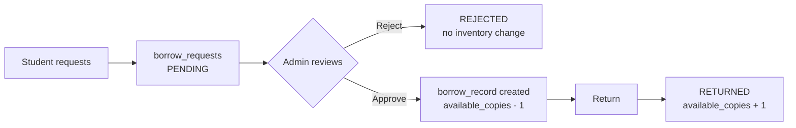

# BookWise

**A university library system where borrowing a book is a request, not a checkout.**

Students sign up with their university ID card. An admin verifies them. Only verified students can request books, and every borrow needs admin approval before a copy leaves the shelf.

<p>


</p>

**Live:** https://university-library-management-syste-nine.vercel.app

<!-- Add a screenshot of the admin approval screen here — it sells the project faster than any paragraph.

-->

---

## What it does

### For students

- **Sign up with your university ID card.** Name, email, university ID number, and a photo of the card itself. New accounts start `PENDING` and stay there until an admin approves them.
- **Browse and search.** By genre, or by title and author from the search bar.
- **Book pages** with cover, summary, rating, and a preview video.
- **Request a book.** You get a pending request, not an instant checkout.
- **Track everything on your profile** — requests waiting on approval, books currently out, and a return button when you're done.

### For admins

- **A separate admin area** covering the whole approval surface: pending registrations, pending borrow requests, borrow logs, and book management.
- **Approve or reject registrations** after checking the uploaded ID card against the university ID number.
- **Approve borrow requests** — this is the moment inventory actually moves. Approval creates the borrow record and decrements available copies. Rejection does neither.
- **Manage books.** Add and edit with cover upload, preview video upload, and a colour picker that sets the spine colour used across the UI.
- **Manage users.** Promote to admin, or remove accounts.

### The borrow flow



A pending request holds no copy. A rejected one leaves no trace in the loan history.

---

## Data model

Four tables in `database/schema.ts`: `users` (status, role, ID-card URL), `books` (copies, cover colour, media URLs), `borrow_requests`, `borrow_records`.

> **Why requests and records are separate tables**
>
> A request is a claim about intent; a record is a claim about physical inventory. Keeping them apart means a rejected request leaves no trace in the loan history, and a returned book doesn't make its original request look unprocessed. That keeps the borrow log honest, which is the table a librarian actually cares about.

`available_copies` is denormalised deliberately — counting active records on every book render would be correct but slow, and the grid reads that number constantly.

---

## Auth and access control

NextAuth v5, credentials provider, JWT sessions, bcrypt. `auth.ts` pins the Node runtime because bcrypt won't run on edge.

| Layer | Job |
|---|---|
| `middleware.ts` | Unauthenticated requests never reach a page render |
| `(root)/layout.tsx` | Redirects to sign-in when there's no session |
| `admin/layout.tsx` | Reads role **from Postgres**, not the JWT, and redirects non-admins |

That last one is deliberate. Tokens are stale by design, and a demoted admin keeping access until their session rolls over isn't acceptable for a permission that can delete accounts.

Signup validates twice: Zod for fast form feedback, then unique constraints as the real guarantee. `lib/db-errors.ts` translates Postgres `23505` into a message naming which field collided.

---

## What runs where

**Server:** all queries, sessions, role checks, password hashing, the ImageKit private key, the approval workflow, rate limiting.
**Client:** form state, uploader, colour picker, toasts, admin table interactions.

> **The line is "what could a user lie about."**
>
> Approval state, role, and eligibility all decide who gets something, so they're decided where the user can't reach them. A client-side role check is a suggestion. Browser-side rate limiting is worthless against the person being limited.

Uploads follow the same logic: `app/api/imagekit/route.ts` hands the browser short-lived auth params, so the file goes straight to ImageKit. The file never touches the app server, and the private key never reaches the browser.

---

## Rate limiting

Upstash sliding window, 3 requests per 10 seconds per IP, on sign-in and sign-up. Tripping it lands on `/too-fast`.

- **A successful login resets the counter.** Otherwise someone who mistypes twice then gets it right is one attempt from locking themselves out. Only failures should accumulate.
- **Signup doesn't spend a second token** when it auto-signs you in, since the user already paid for that request.

---

<details>
<summary><b>Setup</b></summary>

```bash
npm install
```

`.env.local`:

```
DATABASE_URL=your_neon_connection_string
AUTH_SECRET=openssl rand -base64 32

UPSTASH_REDIS_URL=
UPSTASH_REDIS_TOKEN=

NEXT_PUBLIC_IMAGEKIT_PUBLIC_KEY=
NEXT_PUBLIC_IMAGEKIT_URL_ENDPOINT=
IMAGEKIT_PRIVATE_KEY=
```

```bash
npm run db:generate
npm run db:migrate
npm run seed        # loads dummybooks.json
npm run dev
```

To get an admin: sign up normally, then flip that row's `role` to `ADMIN` in the database. There's no bootstrap admin flow yet.

</details>

---

## Known limitations

1. **Approval isn't transactional.** `approveBorrowRequest` checks availability, inserts the record, decrements copies, and updates status as four separate statements. Two admins approving the last copy at once can both pass the check and drive the count to -1.
2. **Nothing stops stacked requests.** `borrowBook` doesn't re-check for an existing pending request, verify the requester is `APPROVED`, or cap how many books one person holds. The UI is the only thing enforcing that.
3. **Search won't scale.** `ILIKE '%query%'` on title and author — no index helps a leading wildcard.
4. **No tests.** None. The borrow state machine is exactly what should have them, and their absence is why limitation 1 went unnoticed.
5. **Rate limiting only covers auth.** Borrow requests, search, and admin mutations are unthrottled.
6. **Due dates are fixed at 7 days.** No renewals, no overdue detection, no late notifications.
7. **Errors stop at `console.error`.** A production failure is invisible unless someone's watching logs.

---

## Next, in order

1. Wrap approval and return in transactions, with the decrement as a conditional update so the database enforces availability instead of the app checking beforehand.
2. Move eligibility rules into `borrowBook` rather than relying on what the UI renders.
3. Tests for the borrow state machine first — that's where a bug corrupts inventory rather than just displaying something wrong.
4. Postgres full-text search plus a genre index.
5. Overdue detection and due-date reminders.
6. Structured logging and error tracking.

---

Built by Harsh Vaibhav.
